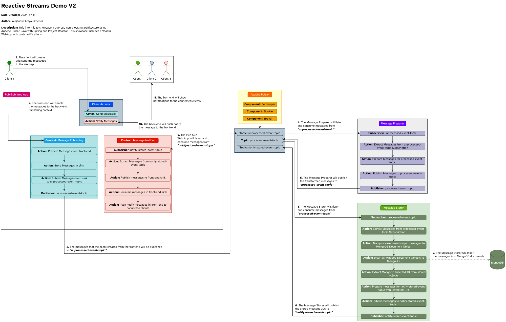

# Reactive Streams Demo V2

    Author: Alejandro Araya Jiménez
    Create Date: 2024-07-06
    Update Date: 2024-07-11

---

## Build and Local Deploy

To run this demo, you'll need to have docker installed, see [Install Docker Engine](https://docs.docker.com/engine/install/) if it's not
installed.

Once Docker is figured out, verify that you're in the root directory of this repository `reactive-streams-demo-v2`, then, type the
following command.

```shell
$ docker-compose up
```

Once all the services are up, you can check the WebApp clicking over this [localhost link](http://localhost:8083/)

To create and send a message, click over ***"Publish a message!"*** or go to this
[localhost link](http://localhost:8083/publish-event-view), then follow the next steps

1. Enter a ***Message body***
2. Click over ***Create Message!*** button
3. Create as many messages as you want
4. Once messages are created, hit the ***Send Messages!*** button

You'll see a notification pop-up in the top part of the screen, and that's a message that has been transformed, stored and notified from
multiple microservices in a non-blocking way!

---

## How it was built

This demo is currently using the following tech:

* [Apache Pulsar](https://pulsar.apache.org/)
* [MongoDB](https://www.mongodb.com/)
* [Docker](https://www.docker.com/get-started/)
* [Temurin Java](https://adoptium.net/temurin/releases/)
* [Reactive Spring](https://spring.io/reactive)
* [Vaadin](https://vaadin.com/)

This containerized demo is currently using `Dockerfiles` for spring microservices.
`Docker Compose` is being used to build the spring microservices images,
to get up and running the `MongoDB` local instance and create the `Pulsar` cluster.

---

## Onboarding Guide

### Topic Subscriber

Create the following interfaces and class implementations and modify as needed.

```java
// TopicSubscriberService.java
public interface TopicSubscriberService<EventPayload> {
    Flux<MessageResult<Void>> subscribe(Flux<Message<EventPayload>> eventFlux);
}


// CustomTopicSubscriberService.java 
public interface CustomTopicSubscriberService extends TopicSubscriberService<String> {
}

// CustomTopicSubscriberServiceImpl.java 
@Service
public class CustomTopicSubscriberServiceImpl implements CustomTopicSubscriberService {

    // This is a 
    private final PublisherService publisherService;

    @Autowired
    public CustomTopicSubscriberServiceImpl(PublisherService publisherService) {
        this.publisherService = publisherService;
    }

    @Override
    @ReactivePulsarListener(
            schemaType = SchemaType.STRING,
            subscriptionName = "custom-topic-subscription",
            stream = true,
            topics = "custom-topic"
    )
    public Flux<MessageResult<Void>> subscribe(Flux<Message<String>> eventFlux) {
        // Sink for Message Acknowledgement
        Sinks.Many<Message<String>> eventSink = Sinks.many().multicast().onBackpressureBuffer();

        // This will extract the messages from the topic event message wrapper
        var extractedEvents = eventFlux
                .doOnNext(
                        eventMessage ->
                                eventSink.tryEmitNext(eventMessage).orThrow()
                )
                .map(Message::getValue);

        // This will publish new events into an example of a wrapped local Hot Stream Service for another topic
        var publishedEventsFromNotifyStoredEventTopic = publisherService.publish(extractedEvents);

        // On subscription, the published events are going to be ignored, and will pass on to the eventSink to publish the
        // acknowledgements for the broker to mark the messages as acknowledged
        return publishedEventsFromNotifyStoredEventTopic.thenMany(eventSink.asFlux().map(MessageResult::acknowledge));
    }
}

```

> You might be able to follow a better example of this code in `pub-sub-web-app`
> at `/src/main/java/org/aaj/example/publisherwebapp/backend/service/NotifyStoredEventTopicSubscriberServiceImpl.java`

### Topic Publisher

Create the following interfaces and class implementations and modify as needed.

```java
// TopicPublisherService.java
public interface TopicPublisherService<EventToBeSent> {
    Flux<MessageSendResult<EventToBeSent>> publish(Flux<EventToBeSent> eventToBeSentFlux);
}

// CustomTopicPublisherService.java
public interface CustomTopicPublisherService extends TopicPublisherService<String> {
}

// CustomTopicPublisherServiceImpl.java
@Service
@Log4j2
public class CustomTopicPublisherServiceImpl implements CustomTopicPublisherService {

    private final ReactivePulsarTemplate<String> reactivePulsarTemplate;
    private static final String TOPIC_NAME = "custom-topic";

    @Autowired
    public CustomTopicPublisherServiceImpl(ReactivePulsarTemplate<String> reactivePulsarTemplate) {
        this.reactivePulsarTemplate = reactivePulsarTemplate;
    }

    @Override
    public Flux<MessageSendResult<String>> publish(Flux<String> eventToBeSentFlux) {
        return reactivePulsarTemplate
                .send(TOPIC_NAME, eventToBeSentFlux.map(MessageSpec::of))
                .onErrorResume(throwable -> {
                    log.error(throwable);
                    return Flux.just();
                });
    }
}


```

> You might be able to follow a better example of this code in `message-storer`
> at `/src/main/java/org/aaj/example/messagestorer/service/NotifyStoredEventTopicPublisherServiceImpl.java`

---

## Annexes

### Diagram



